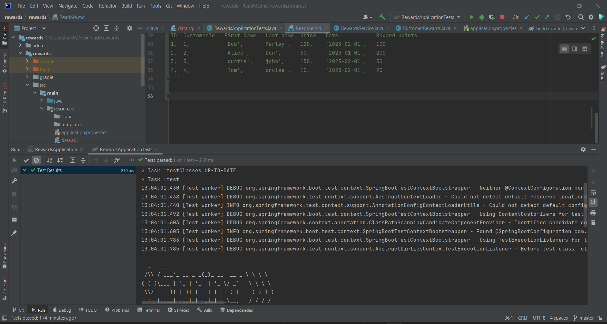

# Rewards
## Customer Rewarding Application 

```
## API - http://localhost:8080/rewards/get-reward-points
Request Method: POST
Sample Request: 
{
  "id":30,
  "customerId":123,
  "firstName":"test",
  "lastName": "test",
  "price":102
}
Sample valid Response: 
{
    "id": 6,
    "customerId": 123,
    "firstName": "test",
    "lastName": "test",
    "price": 102,
    "localDateTime": "2023-02-01T13:32:01.7549293",
    "rewardPoints": 54
}
Sample invalid response: 
{
    "message": "Invalid price ",
    "timestamp": "2023-01-31T00:23:33.9446781"
}

## API - http://localhost:8080/rewards/get-all-customers
Request method: GET 

Sample Response:

[
    {
        "id": 1,
        "customerId": 1,
        "firstName": "Bob",
        "lastName": "Marley",
        "price": 120,
        "localDateTime": "2023-02-01T13:33:52.290142",
        "rewardPoints": 100
    },
    {
        "id": 2,
        "customerId": 1,
        "firstName": "Bob",
        "lastName": "Marley",
        "price": 120,
        "localDateTime": "2023-02-01T13:33:52.290142",
        "rewardPoints": 100
    },
    {
        "id": 3,
        "customerId": 1,
        "firstName": "Bob",
        "lastName": "Marley",
        "price": 120,
        "localDateTime": "2023-02-01T13:33:52.290142",
        "rewardPoints": 100
    },
    {
        "id": 4,
        "customerId": 1,
        "firstName": "Bob",
        "lastName": "Marley",
        "price": 120,
        "localDateTime": "2023-02-01T13:33:52.290142",
        "rewardPoints": 100
    },
    {
        "id": 5,
        "customerId": 1,
        "firstName": "Bob",
        "lastName": "Marley",
        "price": 120,
        "localDateTime": "2023-02-01T13:33:52.290142",
        "rewardPoints": 100
    }
]
```

# Health Check 

```
http://localhost:8080/actuator/health
```

# Sample data that is being inserted while start up
```
ID  CustomerId   First Name   Last Name  price   Date            Reward points
1,  1,           'Bob',      'Marley',   120,    '2023-02-01',   100
2,  2,           'Alice',    'Don',      60,     '2023-01-01',   200
3,  3,           'curtis',   'john',     150,    '2023-02-01',   50
4,  4,           'Tom',      'cruise',   10,     '2023-02-01',   90
```

# Testcase screenshot

